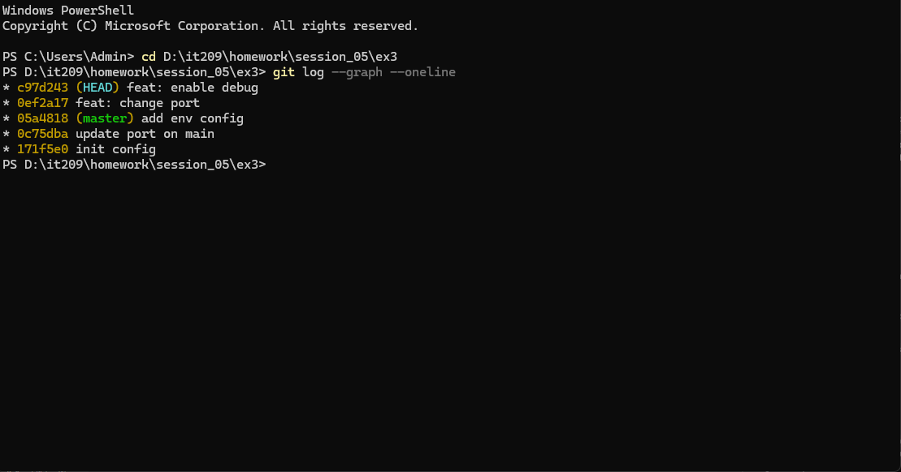

# Báo cáo Bài 3: Xử lý xung đột phức tạp trong quá trình Rebase

## 1. Mục tiêu

- Hiểu và áp dụng quy trình giải quyết xung đột từng bước (step-by-step conflict resolution) trong Git Rebase.
- Giữ lịch sử Git thẳng tắp (linear history), đưa các commit của nhánh tính năng lên trên đầu nhánh chính `master` mà không xuất hiện merge commit phụ.

## 2. Quá trình xử lý Xung đột (Conflict Resolution)

### Lần 1: Conflict ở commit `feat: change port`

- **Nguyên nhân:** Cả `master` (sửa port 8081 + thêm env) và `feature-api` (sửa port 9000) đều sửa các dòng cấu hình trong file `config.json`.
- **Xử lý:** Giữ lại `port: 9000` từ `feature-api` và giữ thông tin `env: "production"` từ `master`.
- **Nội dung `config.json` sau giải quyết:**
  ```json
  {
    "port": 9000,
    "debug": false,
    "env": "production"
  }
  ```


